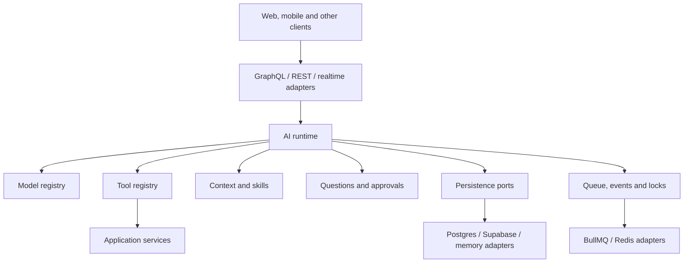

# Architecture and Package Boundaries

## Target system



## Monorepo

```text
agent-platform/
  packages/
    core/ schemas/ models/ agents/ runtime/ tools/ mcp/ skills/ context/
    authorization/ hitl/ persistence/ knowledge/ rag/ files/ documents/
    pdf/ vision/ ocr/ artifacts/ usage/ evals/ graphql/ react/ ui/ testing/
  adapters/
    memory/ postgres/ supabase/ pgvector/ qdrant/ s3/ local-files/
    bullmq/ redis/ nextjs/
  integrations/shareflow/
  examples/
  docs/
```

## Dependency rules

- `core` imports no infrastructure, UI, application or provider package.
- Runtime packages may depend on core contracts, but never ShareFlow domain code.
- Adapter packages implement ports; ports never import adapters.
- Imported MCP tools flow through the same authorization and approval path as native tools.
- Authorization is a port; services take decisions from it and never inline permission logic.
- Contracts, events and tool results carry stable codes and structured data — never pre-localized user prose. The frontend localizes (see docs/14).
- `react` is headless. `ui` depends on `react`, not vice versa.
- GraphQL resolvers call application services and contain no domain logic.
- ShareFlow registers tools, context providers, skills and agents through public interfaces.
- No public API contains Twenty names or types.
- A generic package never imports an integration package. The reverse is the only allowed direction.
- An integration package declares the service interfaces it needs and never imports the application
  that implements them, so it carries no dependency on that application's internals.
- Every package may import only what its own manifest declares. Workspace hoisting makes an
  undeclared import work locally and fail once the package is installed on its own, so the manifest
  is where "builds without ShareFlow or Twenty installed" is actually verifiable.

`packages/scripts/check-boundaries.mjs` enforces these as build failures (rules R1–R10); each has a
planted-violation test beside it.

## Naming conventions

One rule per kind of name, applied everywhere. Deviations fail review.

| Kind | Convention | Example |
|---|---|---|
| npm packages | kebab-case under the `@agentkit` scope | `@agentkit/runtime` |
| Types and interfaces | PascalCase | `ExecutionContext`, `ToolProvider` |
| Branded ID types | PascalCase ending `Id` | `ConversationId`, `RunId` |
| Fields, variables, functions | camelCase | `tenantId`, `createAgentPlatform` |
| Tool names (function-calling) | snake_case, `verb_noun` | `create_post`, `read_tool_output` |
| Meta-tools | snake_case, same rule | `learn_tools`, `request_approval` |
| Imported MCP tools | `mcp__<serverId>__<toolName>` | `mcp__acme__search` |
| Union / enum string members | kebab-case | `external-write`, `tool-call`, `streamable-http` |
| Transport event types | dotted `domain.event`, lower-case | `run.completed`, `tool.failed` |
| Agent and skill IDs | kebab-case, stable, versioned by integer | `assistant` (version `3`) |
| Agent display names | human-readable Title Case | `Social Assistant` |

The double-underscore MCP scheme is deliberate: it matches the namespacing every MCP
client already uses, so imported tools read the same here as everywhere else. Agent and
skill **IDs** are neutral and stable for referencing; the **display name** is where a
product's branding lives.

## Published packages

| Package | Responsibility |
|---|---|
| `@agentkit/core` | IDs, execution context, events, content parts and errors |
| `@agentkit/models` | Provider/model registry and capability resolution |
| `@agentkit/agents` | Declarative, versioned agent manifests |
| `@agentkit/runtime` | AI execution loop and run lifecycle |
| `@agentkit/tools` | Providers, catalog, discovery and dispatch |
| `@agentkit/mcp` | Outbound MCP server consumption as authorization-filtered tools |
| `@agentkit/authorization` | Permission model, tool filtering and scope resolution |
| `@agentkit/context` | Context providers, budgeting and prompt assembly |
| `@agentkit/skills` | Versioned lazy-loaded skills |
| `@agentkit/hitl` | Questions, approvals and durable continuation |
| `@agentkit/persistence` | Storage ports, schema provisioning and unit-of-work contract |
| `@agentkit/usage` | Token counting, cost accounting, quotas and rollups |
| `@agentkit/rag` | Ingestion and permission-aware retrieval |
| `@agentkit/files` | Attachments, metadata, versions and processing |
| `@agentkit/documents` | Parsing and deterministic document edits |
| `@agentkit/graphql` | Schema and thin resolvers |
| `@agentkit/react` | Headless client state and subscriptions |
| `@agentkit/ui` | Optional reusable components |
| `@agentkit/evals` | Datasets, runners and graders |

## Composition API

```ts
const platform = createAgentPlatform({
  modelRegistry,
  stores,
  jobDispatcher,
  realtimePublisher,
  lockStore,
  authorizationPolicy,
  usageRecorder,
  evaluationService,
  vectorIndex,
  blobStore,
});

platform.registerToolProvider(domainToolProvider);
platform.registerContextProvider(domainContextProvider);
platform.registerAgent(assistant);
platform.registerMcpServer(tenantMcpConnection);
```

The names above are neutral placeholders. A consuming application supplies its own
providers and agents; product-specific names (for example ShareFlow's social assistant)
live only in that application's integration package.

## Acceptance criteria

- Generic packages build and test without ShareFlow or Twenty installed.
- A minimal example app can compose memory storage and a provider adapter.
- ShareFlow-specific functionality exists only under its integration.
- Package dependency checks fail CI on forbidden imports or circular dependencies.

