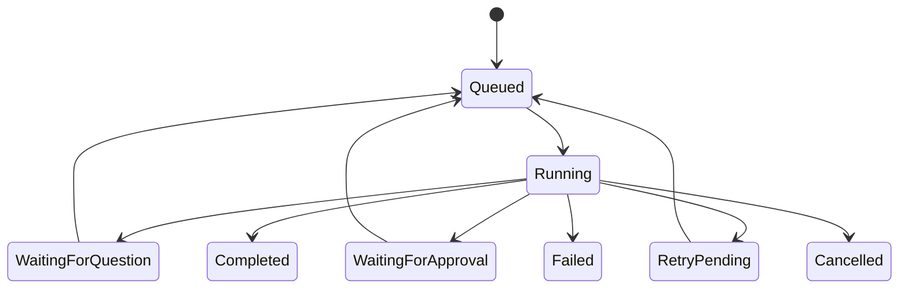

# Durable Runtime, Streaming and HITL

## Run lifecycle



## Durable execution

1. API stores the user message and creates a queued run.
2. Job dispatcher enqueues the run.
3. Worker atomically claims it under a distributed lock.
4. Runtime streams provider and tool events into typed message parts.
5. Worker checkpoints parts and publishes realtime diffs.
6. Completion transaction stores final state, usage and audit information.

Required behavior:

- Atomic claim prevents duplicate workers.
- Periodic checkpointing allows page refresh and worker recovery.
- Keepalive identifies live streams.
- Stale streams are reaped and retried safely.
- Cancellation propagates to provider and tools.
- Reconnect returns persisted state plus missing events.
- Dangling tool calls are finalized as interrupted/errors.
- A conversation may queue another user message while a run is active.

## Runtime limits

Per agent/run:

- Maximum steps and tool calls.
- Wall-clock timeout.
- Input, output and cost ceiling.
- Retry count and backoff.
- Maximum inline tool-output size.

## Retry policy

Transient failures are retried with a Claude/Anthropic-SDK-style policy rather than a naive
fixed loop:

- **Exponential backoff with jitter** between attempts, up to a bounded maximum attempt count.
- **Honor server timing**: when the provider returns a `retry-after` / `retry-after-ms` header,
  wait at least that long before the next attempt.
- **Retry only transient classes**: `429` rate limits, `408`/`409`, `5xx`, and `529` overloaded.
  Deterministic `4xx` validation errors are not retried — they fail fast.
- **Retries are safe because writes are idempotent**: every external/destructive call carries an
  idempotency key (see Idempotency below), so a retried publish/send/schedule returns the original
  result instead of firing the side effect twice.
- The run surfaces `RetryPending` between attempts; exhausting the attempt budget moves it to
  `Failed` with the last error preserved.
- Each retry emits a `run.retry-pending` transport event with attempt number, max attempts,
  next-attempt time and the triggering error, so the frontend can show a live retry indicator
  (attempt/countdown/reason) rather than only the status.

## Questions

`ask_questions` is used for consequential ambiguity that cannot be resolved from context or tools. Questions persist as typed message parts. The run moves to `WaitingForQuestion`; an answer mutation records the answer and queues a continuation.

### How the loop closes (#163)

The paragraph above described the intent, and for a long time it described only that. `question.requested` was
in the event union and the worker turned it into `waiting-for-question` — and **nothing in the platform could
emit one**. A tool that raised a question had it stored durably, the model was told it had asked, and the run ran
on to completion. Then the mirror-image gap on the way back: `approvals` had a resume path from the start and
questions had none, so an answered question was invisible to the run that asked it and the model asked again.

The loop is now the same shape as the approval loop, deliberately, because the two halves of "ask a human
something" should not work differently:

| Step | Mechanism |
|---|---|
| A tool asks | `questions.ask(...)` stores a `PendingQuestion` with one or more `QuestionSpec`s, then throws `questionPending(question)`. |
| The run parks | The engine recognises the `question_pending` code, hands the model a marker naming the interaction, and emits `question.requested`. The worker parks the run in `waiting-for-question`. |
| A person answers | `answerQuestion` records the answers, transitions the run back to `queued` and enqueues the continuation — once. |
| The model is told | On resume the engine reads `findAnsweredQuestion(runId)`, emits `question.answered`, and pushes the answers into the model's history as a `user`-role line. |

Two design points worth stating, because both are asymmetries with approvals rather than oversights:

- **A tool must not block waiting for a reply.** A delegate that awaited a human would hold a worker slot for as
  long as someone takes to read, which is the whole thing the durable runtime exists to avoid. So it stores,
  throws, and returns control.
- **There is no claim step.** `findDecidedApproval` is paired with `claimApproval` because a claim makes an
  external write happen exactly once. An answer produces a line of history, which is idempotent, and scoping the
  read to the run already bounds it — the next turn is a different run. Adding a claim would mean a *recovered*
  run rebuilt its history without the answer, which is the original bug again.

**One interaction can carry several questions.** `PendingQuestion.questions` is a list and `answers` is keyed by
each spec's `key`, so a caller needing three answers asks once and resumes once. A tool that asks three times
instead gets three interactions, and the second and third are raised while the run is already being parked for
the first — leaving orphaned questions whose prompts reappear after the first is answered.

`QuestionSpec` carries `options`, `multiple` and `allowOther`: pick one, pick several, or write your own, and any
combination. Without them a client cannot tell a choice from a hint and has to guess from the prompt.

### Reading a pending interaction

`question.requested` and `approval.requested` carry only an `interactionId`. That is deliberate — events are
thin, and a payload duplicating the question would be a second copy to keep in step with the stored one. The
read side is a query:

- `pendingQuestion(runId)` — the specs to render, with the optional fields resolved to real values rather than
  absence a client has to interpret.
- `pendingApproval(runId)` — the tool name, summary, risk category and the **normalized input**, so what runs is
  what was shown.

Both return null once resolved, so a client cannot offer a decision twice. Before these existed a client could
answer a question it had no way to display, and an approval card fell back to "Run a tool?" — asking someone to
authorise an action it could not name is how approval becomes a reflex.

## Approvals

`request_approval` is required before policy-classified actions such as publishing, scheduling, sending replies, deleting, external sharing and paid marketing changes.

Decisions:

- Allow once.
- Allow for this conversation.
- Always allow for principal/tenant/category, when tenant policy permits.
- Deny.

The pending approval stores the exact normalized tool name/input, risk category, summary, estimated cost, expiry and idempotency key. Resumption executes the stored input—not a model-regenerated version.

### How the loop closes

The four decisions are not four flavours of the same thing. `allow-conversation` and `allow-always` are
standing permissions and produce an `ApprovalGrant`. `allow-once` produces **no grant at all** — a grant
is standing by definition, so minting one for a one-time decision would widen the authority the human
gave. Its single execution is instead claimed off the interaction itself:

1. The run calls a gated tool. The gate finds no standing grant and refuses.
2. The run path turns that refusal into a pending approval carrying the schema-normalized input and an
   idempotency key derived from the run and the call's arguments. The run pauses to
   `waiting-for-approval`. Invalid input is refused here rather than raised: nobody should be asked to
   authorize a call that cannot succeed.
3. A decision is recorded once and the run is re-enqueued.
4. The resumed run **claims** the approval — a compare-and-set on the interaction, so two workers racing
   one run produce exactly one claim — and then executes the *stored* tool and the *stored* input,
   presenting the claimed interaction to the gate as its authorization. A denial or an expiry is claimed
   too, so a resumption never loops on a decision it has already honoured.

Every step fails closed. An interaction nobody decided cannot be claimed; a claim for one tool does not
authorize another; a claim from one run does not travel to another; and a gate with no interaction store
to check against refuses every one-time authorization rather than trusting it.

Wiring is the host's: build the gate with both the grant store and the interaction store, build the run
path over the tool registry and the approval service, and hand it to the engine.

```ts
const approvals = createApprovalGate({ grants, interactions });
const registry = createToolRegistry({ providers, authorization, idempotency, approval: approvals });
const engine = createDefaultEngine({
  /* … */
  approvals: createRunApprovals({
    interactions,
    approvals: createApprovalService({ interactions, grants, dispatcher }),
    tools: registry,
  }),
});
```

## Idempotency

Every external/destructive tool requires an idempotency key derived from tenant, run and tool-call identity. A resumed or retried call returns the original result instead of repeating the side effect.

## Transport events

Stable events include:

- Run queued/started/checkpointed/completed/failed/cancelled.
- Run retry-pending, carrying `attempt`, `maxAttempts`, `nextAttemptAt` and the triggering error.
- Content part added/updated.
- Tool started/completed/failed.
- Question requested/answered.
- Approval requested/decided.
- Usage updated.
- Context compacted.

Transports map these events to GraphQL subscriptions, SSE or another channel without changing runtime semantics.

## Acceptance criteria

- Client refresh loses no persisted output.
- Worker termination produces safe recovery without duplicate external actions.
- Pending interactions survive deployment/restart.
- Approval cannot be bypassed through direct tool execution.
- An `allow-once` decision permits exactly one execution, issues no standing grant, and runs the stored
  input rather than a regenerated call.
- Cancellation and retry states are observable and tested.
- Retries use backoff with jitter, honor `retry-after`, retry only transient classes, and never double-fire an idempotent external write.

