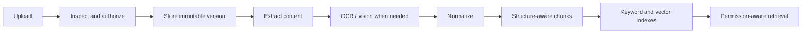

# RAG, Attachments, Vision and Documents

## File pipeline



## Attachments

Support upload sessions, progress, MIME sniffing, size limits, extension checks, optional malware scanning, versions, permissions, signed references and processing state. Original versions are immutable.

Initial formats:

- Images.
- PDF.
- Markdown, text and HTML.
- DOCX.
- CSV/XLSX extraction.
- PPTX extraction.
- Audio/video transcription through adapters.

## PDF, OCR and vision

- Detect pages with usable text before OCR.
- Render and OCR only necessary pages.
- Correct orientation and retain bounding boxes/confidence.
- Extract tables separately.
- Preserve page-level provenance.
- Use vision for charts, diagrams, screenshots and visual meaning.
- Mark low-confidence extraction.
- Treat extracted/OCR content as untrusted data, never instructions.

PDF writing supports report generation, page composition, merge/split and optional watermarking. Deterministic renderers own file creation.

## Document writing

Models produce structured edit proposals. A deterministic writer validates and applies them to a new artifact/file version. Destructive overwrite requires approval.

Artifacts are markdown/structured-content first and support version history, restore and export to HTML, PDF and DOCX.

## RAG ingestion

Stages:

1. Authorization and source registration.
2. Extraction and normalization.
3. Structure-aware chunking.
4. Embedding and keyword indexing.
5. Validation and source publication.

Chunks retain source/version IDs, type, page/slide/sheet/cell/timestamp location, parent relation, metadata, hash and permission scope.

## Retrieval

Use hybrid retrieval:

1. Query interpretation.
2. Authorization filters applied before search.
3. Vector and keyword retrieval.
4. Metadata filtering.
5. Rank fusion.
6. Optional reranking.
7. Context-budget selection.
8. Citation-ready output.

Deletion or permission changes propagate to chunks and indexes. Embedding-model changes support versioned re-indexing.

## Interfaces

- `BlobStore`
- `FileInspector`
- `DocumentParser`
- `OcrProvider`
- `VisionProvider`
- `TranscriptionProvider`
- `ChunkingStrategy`
- `EmbeddingProvider`
- `VectorIndex`
- `KeywordIndex`
- `Reranker`
- `ArtifactRenderer`

## Initial tools

- `list_files`, `read_file`, `search_files`
- `scan_document`, `analyze_image`
- `extract_text`, `extract_tables`
- `summarize_document`, `compare_documents`
- `create_artifact`, `update_artifact`, `export_artifact`
- `create_pdf`, `convert_file`
- `get_file_processing_status`

## Acceptance criteria

- Retrieval never returns another tenant's content.
- Citations resolve to exact source versions and locations.
- Removing a source removes its searchable content.
- OCR confidence and failures are visible.
- Original files remain unchanged unless an explicit approved replacement occurs.
- RAG evaluation covers retrieval relevance, groundedness and citation correctness.


## Attachment storage (#129)

`BlobStore` above is one interface. The implementation is two, and the split is not cosmetic.

`BlobStore` as built in #102 stores **JSON values** — a `put(value: unknown)` returning a `BlobRef`, backed by
a `blobs` table. That is the right home for a large tool result or a checkpoint payload, and the wrong home
for file bytes: bytes in a relational column means base64 in `jsonb`, which #102 declined to do when it
refused to make `blobs` a pointer table. So attachments use two ports:

- **`FileMetadataStore`** — one row per attachment, in Postgres (`0013_files`). Tenant-scoped, keyset-paged,
  soft-deleted, and RLS-forced like every other table.
- **`FileContentStore`** — the bytes, in object storage. `adapters/supabase/storage.ts` implements it over the
  Supabase Storage REST API. This is the only port where the Supabase adapter is *not* the Postgres adapter
  under another name; the conformance matrix marks the port `n/a` for `postgres` and asserts alias identity
  for the other twenty.

### The lifecycle

An upload is two writes, and the order is the design:

1. metadata `pending`
2. bytes
3. metadata `pending → stored`, compare-and-set

A crash between 1 and 2 leaves a `pending` row — visible to reconciliation, invisible to the user. The reverse
order would leave an object nothing references: invisible to everything, and billed for. **An orphan you can
find beats an orphan you cannot.**

Deletion runs the mirror. Deleting a conversation moves every live file to `deleting` in one statement — so a
file uploaded mid-delete cannot be missed — and the bytes go afterwards, in a sweep that deletes the object
*before* moving the row to `deleted`. Object storage cannot join a database transaction; the intermediate
state is named rather than pretended away.

### Limits and access

- The declared size is checked before the stream is accepted, with the limit stated in the refusal. The
  declared size is a *claim*, so the stream is also capped while it is read, and the cap throws from inside
  the generator so the producer is cancelled rather than drained.
- Media types are an exact list. No wildcards: `image/*` is how an SVG becomes an accepted image.
- Reads are mediated. A signed URL's life is clamped to 15 minutes at the service, because a signed URL is a
  bearer token in a query string — it reaches logs, browser history and anything that echoes a URL. An adapter
  that cannot sign returns `null` and the read is proxied; it never invents a URL.
- Entitlement to a file is entitlement to its **conversation**, enforced through `AuthorizationPolicy` as a
  required dependency. An unentitled caller gets the same `not_found` as a nonexistent id, or the endpoint
  confirms which ids exist.

### Reconciliation

The job **reports and never deletes**, both directions: rows with no bytes, and bytes with no row. Deleting on
the strength of "probably an orphan" is how a file whose metadata write was merely slow goes missing.

### Attachments in context (#130)

Governing principle 6 — *"Large files and tool results are referenced, not injected wholesale into model
context"* — is easy to state and easy to break by accident, so it is held structurally rather than by
convention.

**The context provider is constructed with a `FileMetadataStore` and nothing else.** It has no
`FileContentStore`, so it cannot read a byte of an attachment even if a future edit tried to. A rule can be
forgotten; a provider with no way to reach the content cannot forget it.

**An attachment's cost does not grow with the file.** The rendered line carries a rounded, *fixed-width*
size — `  1.0 KB`, `  100 MB` — rather than a byte count, so the cost is exactly constant across every order
of magnitude a file can have. What it does scale with is the filename, which is the user's own text and
belongs in context; that is bounded too. The list itself is capped, because linear in something the user
controls is the same unbounded growth by a slower route, and past the cap the section says so and names the
tool that lists the rest.

The `file` message part is already the reference: `fileId`, `filename`, `mediaType`, `byteSize`, and no
content field. Rather than add a second part type meaning the same thing — which would have forced the
frontend change AC-5 exists to avoid — the part was hardened instead. `providerMetadata` on a `file` or
`image` part is capped at 2 KiB and refuses a `data:` URI at any nesting depth: that bag is
`Record<string, unknown>`, which is exactly the shape a base64 payload fits into, and a part carrying its own
content would satisfy every other rule while breaking the only one that matters.

**Bringing content in is a separate, bounded act.** `read_attachment` returns at most 32 KiB, clamps rather
than refuses a larger request, and reports the offset to continue from — so a model can page a long document
but cannot flood the transcript, which matters because a tool result *is* a message part and therefore
permanent. It reads through `FileService`, so the conversation entitlement check is the same one the read
path uses rather than a second copy. Media types it will decode as text are an exact list, and a refusal
names the alternative, because a refusal that does not say what to do next produces a retry loop.

The storage `contentKey` never appears in front of the model. The reference is the file *id*; the key is the
platform's business, and a model that could see it could put it in a tool argument.

## Document extraction (#131)

Extraction turns an opaque attachment into something the model can reason about. Three decisions shape it.

### Structure, not a flat string

The intermediate is a **block list** — headings keep their level, tables keep their cells, lists keep their
items — not one long string. A flat string is what every quick extractor produces and it destroys exactly the
information a question is usually about: *"what was Q3 revenue?"* is answerable from a table and unanswerable
from that table flattened into prose, because the row and column that gave the number its meaning are gone and
the model has no way to know they were ever there.

The renderer turns blocks back into Markdown for a model, so a table arrives as a table.

### Failure is a value, not an exception

`ExtractionFailureReason` is a closed set, and every value exists because the *user-facing sentence differs*:

| Reason | What the user should do |
|---|---|
| `unsupported-type` / `skipped` | Nothing — this type is not extracted at all |
| `too-large` | Split the document, or attach the part that matters |
| `too-many-pages` | Same, and the limit is named in the message |
| `timed-out` | Retry, or simplify the document |
| `encrypted` | Remove the password protection |
| `no-text-layer` | Run OCR — this is a scan, not a broken file |
| `malformed` | Re-export it |

`no-text-layer` and `malformed` are deliberately separate: collapsing them would send someone to re-export a
file that needed a different pipeline entirely. The pipeline records the failure on the file and never throws
for a document problem, so an unreadable document is visibly unreadable rather than silently empty.

### Bounded in every dimension a document can grow

A document is attacker-controlled input, so a page limit alone is not enough:

- `maxBytes` — bytes read from storage. **Refuses** rather than truncating: half a PDF is malformed, not shorter.
- `maxPages` — refused with the count and the limit both named.
- `maxTextBytes` — extracted text kept. **Truncates** and says so, because half a document is still useful.
- `maxBlocks` — separate from `maxTextBytes`, because a million empty paragraphs costs no text and a great deal
  of everything else.
- `timeoutMs` — enforced by the *pipeline*, not the parser: a parser stuck in a loop cannot check its own clock.
- An **inflated-stream ceiling** inside the PDF parser. Checking the file size does not catch a decompression
  bomb; a small file can inflate to gigabytes, so the ceiling is on the inflated total.

### Asynchronous by construction

Extraction has its own queue, not the run queue. A shared queue would let a hundred-page PDF sit in front of a
user's next message, and the two kinds of work want different concurrency anyway — extraction is CPU-bound, a
run is mostly waiting on a provider. `upload` *requests* extraction and an enqueue failure is logged and
dropped: the bytes and the row are already durable, and an unreachable queue must not turn a successful upload
into a failed one. `sweepStuckExtractions` picks up both silent shapes — a `pending` file whose enqueue was
lost, and a `running` file whose worker died.

A failed *document* completes its job; only an infrastructure failure fails one. Retrying a scan with no text
layer produces the same answer at the same cost forever.

### The PDF parser's limits, stated

Text extraction is over the raw PDF syntax with `node:zlib` and no dependency. It handles what the tools people
actually use produce — Word, LaTeX, print-to-PDF, Google Docs, most report generators — by walking content
streams and following the text operators, inferring headings from font size (a PDF has no headings; it has text
that happens to be bigger) and tables from repeated column positions.

It does **not** handle encrypted documents (refused: extracting from one means implementing the security
handler), scans with no text layer (reported as such, which is the answer that points at OCR), or Type0/CID
fonts whose `ToUnicode` map cannot be applied (detected as mojibake and warned about — a garbled answer is
worse than a refusal). Tables are the honest weak spot: a PDF contains text at coordinates, not tables, so a
grid is recovered when the evidence is strong and the text is left as paragraphs when it is not. A wrong table
is worse than no table, because a wrong one looks authoritative.

### Read in windows

`read_document` returns at most 50 blocks or 24,000 characters and reports the block to continue from. The
window is in **blocks, not characters**, because a character bound can land inside a table and hand the model
half of one — worse than none, since the missing rows are invisible and the model answers confidently from what
it can see. When there is nothing to read it reports *why*, and marks the error retryable only when retrying
could change the answer.

## OCR and vision (#132)

A screenshot and a scanned PDF are inert without these. Both feed the *same* derived-artifact path as #131, so
`read_document`, the context section and the blob see one representation regardless of where the text came
from — which is what stops "can the model read this?" depending on the format the user happened to attach.

### Two ports, not one

| Port | Job | Built in? |
|---|---|---|
| `OcrProvider` | **Transcribes.** Returns the words on the page, with a confidence. Does not interpret. | **No** — see below |
| `VisionProvider` | **Describes.** Says what an image shows. The only useful answer for an image with no text. | Yes, over the model registry |

Conflating them would force one adapter to do both badly. For a dashboard screenshot the answer is *both*:
either alone loses half of it — the numbers without the layout, or the layout without the numbers. A vision
description is labelled as one, because a description is the model's *reading* of an image and a transcription
is what the image says; presenting them identically would let a later answer cite an inference as a quote.

**There is no built-in OCR adapter, and there cannot honestly be one.** OCR needs a trained engine —
Tesseract, or a hosted service. The PDF parser in #131 could be written over the raw syntax with `zlib`
because a PDF *contains* its text; a scan does not contain text at all. So `OcrProvider` is a documented port
with no implementation in this package. The alternative — a stub returning empty text — would make every scan
look like a successful extraction of nothing, which is precisely what `no-text-layer` exists to prevent.

The port takes the **original bytes and media type**, not page images: rasterising a PDF needs a renderer, and
every real service (Textract, Document AI, Azure Document Intelligence) accepts a PDF directly and does that
itself.

### A model without vision is never selected

`ModelRegistry.resolve({ role, requiredModalities: ["image"] })` already throws `capability_unavailable` when
nothing satisfies it. So the guarantee holds because the caller cannot *obtain* a model to pass to the vision
call — not because the vision call checks one. A check there would be a second gate to keep in step with the
first, and the weaker of the two would be the one that mattered. The refusal is deliberately not caught: a
fabricated description is the one outcome worse than no description.

### The OCR fallback is narrow on purpose

A scanned PDF is found by the text parser reporting `no-text-layer`, and **only** that reason triggers the
fallback. An encrypted or malformed document is not retried through OCR, because OCR will not decrypt anything
and the second attempt would cost money to reach the same conclusion. This is where #131's insistence that
`no-text-layer` be its own reason rather than folded into `malformed` becomes load-bearing.

### Confidence, and what its absence means

`confidence` is **required** on `OcrResult`. An optional field would default to the optimistic answer and
nobody would notice — an engine that cannot report one says `0` and lets the flag fire. Below
`LOW_CONFIDENCE_THRESHOLD` (0.7, roughly where OCR stops being "a few wrong characters" and becomes "wrong
words" — and a wrong word is worse than a gap, because the sentence still reads) the extraction is flagged in
three places, because a consumer might look at any of them: a warning in the document, `lowConfidence` on the
read result, and a marker on the attachment's reference line so a model choosing between attachments knows
before it reads any of them.

On `ExtractedDocument` **and** on the file record, so a listing can flag a low-confidence extraction without
fetching the blob. Absent means the extraction was not probabilistic — a PDF's text layer is *read*, not
recognised, so a confidence there would be a number with nothing behind it, and `1.0` would be a lie about a
different kind of extraction.

### Cost

A vision call is reported on the parse result and the pipeline forwards it to `onPricedOperation` *before*
writing the blob and strips it from what is stored — a priced operation already happened, so a crash must
still have billed it, and a stored document has no business carrying billing data. A ledger write that fails
is logged, not thrown: an unbilled call is a smaller problem than a document the user paid for and cannot read.

`UsageEvent.runId` is required and an extraction is **not a run**, so it borrows the field with a namespaced
`extraction:<fileId>`. Two consequences: the ledger stays single, which is what "through the existing usage
hook" asks for; and `usageDedupeKey` is `(runId, stepId)`, so a re-enqueued extraction records **once** rather
than charging a tenant twice for the same image. The wart is that `runId` no longer always names a run — a
separate cost dimension would be cleaner if the ledger ever needs to distinguish them.

## Artifacts (#133)

An artifact is how substantial assistant output becomes a named, versioned thing rather than text buried in a
thread — the prerequisite for exporting it.

### Two tables, not one

`artifacts` holds the identity that outlives any single version: a name, an owning conversation, a shared
link's target. `artifact_versions` holds the versions. Folding them together would mean either duplicating
that identity on every version or having no row to point a deleted link at.

`latest_version` is **denormalised** onto the artifact row on purpose. It is read on every resolve of "the
current version", and a `MAX()` subquery there would be a second source of truth that can disagree with the
rows it summarises under concurrency — which is the exact race `addVersion`'s compare-and-set exists to settle.

### Versioning is a compare-and-set

`addVersion` takes `expectedLatestVersion` and the `UPDATE` carries `WHERE latest_version = $expected`. Two
concurrent regenerations both hold `expectedLatestVersion: 1`; exactly one wins, and the loser is *told* so.
Without that, both become version 2 and one silently replaces the other — which is "earlier versions remain
resolvable" failing in the way nobody notices. `UNIQUE (tenant_id, artifact_id, version)` says the same thing
a second time, at the level the application cannot be wrong about.

**Restore makes a new version**, it does not move a pointer backwards. Moving one would make the history lie
about what happened, and *"the version that was current on Tuesday"* is exactly the question a shared link
asks. The restored version reuses the original's `contentRef` — a blob is immutable, so sharing it is safe, and
copying would double the storage for a byte-identical value.

### Content by reference, and the write order

The version row holds a `BlobRef` and there is no column content could be inlined into. An artifact is the
thing a user exports, so it grows without limit, and an unbounded value in a row is the antipattern `0011`
rejected for blobs and `0013` for file bytes.

The blob is written **before** the row. A crash between them leaves an unreferenced blob, which is waste; the
reverse leaves a row pointing at content that does not exist, and a dangling reference reads as corruption.
Same reasoning, opposite order, as the file upload in #129 — because there the metadata row is the evidence
reconciliation needs, and here the reference is the thing that must never dangle.

### Provenance is required

`ArtifactProvenance` is required on every version: the run, the producing tool, the normalised inputs, and any
attachments the content was derived from. Provenance that *can* be absent is provenance that will be, on the
version someone eventually asks about. The inputs are the **normalised** ones rather than the model's prose
request, because a regeneration that produced a different result should be explicable by comparing two
versions' inputs — and free text does not compare.

The conversation is on the *artifact*, not repeated per version: it owns the artifact, so duplicating it would
be a second place for it to disagree.

### Access follows the conversation

`AuthorizationPolicy` is a required dependency of `ArtifactService` and every entry point takes the decision
on the **conversation** — read, write, history, restore, delete and list alike. An artifact is therefore never
more accessible than the conversation that produced it, and there is no second permission model to keep in
step with the first. An unentitled caller gets the same `not_found` and the same message as a nonexistent id.

Rendered formats — PDF, DOCX — are *exports* of an artifact rather than kinds of one, which is why
`ARTIFACT_KINDS` does not list them: an artifact exported twice is still one artifact, and making PDF a kind
would make it two things that drift. Export is #134.

## Export rendering (#134)

An artifact that cannot leave the platform in a portable format does not solve the user's problem of sharing
output with colleagues. PDF and Markdown, rendered on the worker tier.

### An export is not an artifact version

The issue's wording asked for a render to produce "a new blob and an artifact version". It produces an
**export record** instead, and the reason matters: #133's versions are versions of the *content*, and a PDF is
a rendering of one. Making a render a new version would bump `latestVersion` for a reason unrelated to what
the assistant wrote — and exporting one artifact to two formats would create two "content versions" that are
not content.

The export record is keyed `UNIQUE (tenant_id, artifact_id, version, format)`, which delivers the property the
wording actually wanted: **the same export is re-downloaded rather than re-rendered**, and the constraint makes
that hold under two simultaneous requests rather than only under one. `claim` returns the winner's row to the
loser, because the loser's next move is the same either way — read this row.

An export is of a *version*, never of "the artifact". Sharing one across versions would hand someone last
week's document.

### The PDF writer

Dependency-free, over the raw PDF syntax. Writing is far more tractable than reading: no unknown producers, no
broken xrefs, no font encodings to guess. Base-14 fonts, so the file carries no font program — a report is a
few kilobytes instead of a few hundred, and the licensing question does not arise. The cost is the character
repertoire: **WinAnsi**, so no CJK, and `unsupportedCharacters` reports what was dropped rather than emitting
blanks. A report whose title rendered as `????` is a document someone forwards believing it is correct.

Line wrapping uses real Helvetica advance widths. A monospace approximation wraps badly enough to be obviously
wrong — proportional text estimated at a fixed width either overflows the margin or leaves a third of the line
empty. A word wider than its column (a URL, usually) is broken mid-word rather than allowed to run off the
page, because an overflowing line is silently truncated by the viewer.

Tables scale their column widths from the widest cell rather than splitting evenly, and the header row repeats
after a page break — a table whose headings are on the previous page is a table nobody can read.

### Determinism is a requirement (AC-6)

A PDF normally carries a `CreationDate` and often a random `/ID`, either of which makes two renders of the same
input differ. Both are fixed: the date defaults to a **constant** and the `/ID` is derived from the content. A
deployment that wants real dates in its PDFs sets `documentDate` and gives up the guarantee knowingly.

Verified by rendering twice and comparing bytes, *and* by asserting the constant's value — comparing two
renders alone is not enough, because two calls microseconds apart produce the same millisecond-resolution
timestamp and a `new Date()` regression slips through.

### Fidelity is verified by an independent reader

The rendered PDF is parsed back with the **extraction parser from #131** and its headings, paragraphs and
table cells are asserted present. That is stronger than a golden blob: a golden file proves the writer still
produces what it produced yesterday, whereas a parser proves the structure is actually recoverable from the
bytes by something that knows nothing about the layout code.

### Downloads go through the file ports (AC-5)

A rendered export becomes a `FileMetadata` row plus content in `FileContentStore`, so it inherits #129's
conversation entitlement and 15-minute signed URLs. There is no code in the export layer that could produce a
permanent URL, because there is no code in it that constructs a URL at all.

Entitlement is **re-checked on every download** rather than trusted from the request that created the export: a
user removed from a conversation must stop being able to download what they exported while they were in it.

The export's file is marked `extraction: skipped` — a rendered export *is* extraction output, and without that
the #131 extraction sweep would pick up every export forever and try to read back a PDF it just wrote.

### A failed render leaves nothing partial (AC-4)

The file row is created, the bytes written, and only then is the export marked `rendered`. A crash leaves a
`pending` file row that reconciliation can see and an export still `pending` — never a row promising a download
that does not exist. The schema says the same thing twice: `CHECK ((state = 'rendered') = (file_id IS NOT
NULL))` and `CHECK ((state = 'failed') = (failure_reason IS NOT NULL))`.

A thrown renderer is the *renderer* being broken, not the artifact being unrenderable: the user gets a
sentence and the stack trace stays in the log. A failed render **completes** its queue job — retrying an
artifact that cannot be rendered produces the same answer at the same cost forever. Only infrastructure
failures throw, and only those are retried.

## Vector search and the embedding pipeline (#135)

The first buildable piece of RAG: chunks, embeddings, and a permission-aware nearest-neighbour search.

### Two ports, one table

`KnowledgeStore` owns the rows — content, provenance, which embedding produced them. `VectorIndex` owns the
similarity search. A pgvector deployment satisfies both from `knowledge_chunks`; a deployment on a dedicated
vector database satisfies them from two systems, and nothing above changes.

### The authorisation subject is on the chunk

This is the most important decision here. Filtering **inside** the query is not a performance preference — it
is the only version that does not leak. Filter after retrieval and the result *count* tells you what you were
not allowed to see: ask for ten chunks, get three, and you have learned that seven exist; a few queries later
you know roughly what they are about.

So `authSubject` travels with the chunk, and `VectorIndex.search` takes `authSubjects` as a **required**
argument. An optional filter is a filter someone omits, and the day it is omitted every tenant member can
retrieve every chunk. An empty array means "no subjects" and correctly returns nothing — the opposite reading
would be the worst possible default.

### HNSW, not IVFFlat

The SPEC asks for a documented choice. **HNSW**, at pgvector's defaults (`m = 16`, `ef_construction = 64`).

IVFFlat builds faster and uses less memory, and it needs a representative sample at build time: its recall
degrades as the data grows past what its lists were trained on, and the fix is a periodic per-tenant rebuild.
In a multi-tenant knowledge base where every tenant's corpus grows continuously and unevenly, "recall silently
falls until someone rebuilds" is the disqualifying property — not the cost. HNSW's recall is stable as rows are
added, which is worth its slower build and larger memory here.

pgvector's own published benchmarks put those parameters at roughly 0.98 recall@10 on 1536-dimension
embeddings; that is the recorded target for the index. The platform's own query set is measured separately
against the exact reference index (see below), because an approximate index's recall and the retrieval logic's
correctness are different things and conflating them makes both untestable.

### Dimensions are a migration, not a re-index

`EMBEDDING_DIMENSIONS` (1536) lives on the **port**, not in an adapter — the same reasoning that moved
`DEFAULT_SESSION_STATE_MAX_BYTES` there in #97. A vector column has one width and an index cannot span widths,
so a model whose *output size* changes needs a re-migration; a model whose *version* changes needs a re-index.
`EmbeddingModelRef` carries both, and a size mismatch is refused rather than queued.

The reference adapter accepted 768 while pgvector refused it, until running the harness against real pgvector
caught it. That is exactly the laxness #129 named: a reference adapter more permissive than the real one turns
a production write failure into a passing test.

### Re-indexing needs no bookkeeping

`listStaleSources` asks the database which sources were embedded by anything other than the current model, so
the work list is **derived from what is stored**. `reindexBatch` does one page and reports what remains; a
caller loops until zero. An interruption therefore loses at most one page and *no bookkeeping* — there is no
cursor to persist and so no cursor to lose. A source that can no longer be reloaded has its chunks removed
rather than retried forever, because otherwise the work list never drains and the re-index never finishes.

Chunk ids are derived from `(sourceType, sourceId, index)` and so are **stable across an edit**: a citation
recorded against chunk 0 still points at chunk 0 after the document changes.

### Chunking respects structure

The input is #131's block list, which is the payoff of extracting to structure: a chunker that only sees text
guesses where a section ends, and one that sees blocks knows.

- A **table is one chunk**, whole. Splitting one separates a number from its column header, which is the exact
  failure the extraction design exists to avoid. A table too large for one chunk is split *by rows with its
  header repeated*, so every piece still says what its columns mean.
- The **nearest heading path is prepended** to every chunk. "Revenue rose 9%" is unretrievable alone and
  retrievable as "Quarterly Review > By region > Revenue rose 9%" — and it is what makes a hit explicable.
- A heading is never a chunk of its own: it retrieves nothing useful and costs an embedding call.
- Overlap is **by block**, not by character. Overlapping mid-sentence produces two chunks that each contain
  half a thought and neither the whole one.

### Freshness

`FRESHNESS_TARGET_MS` is **60 seconds**, and it is a commitment rather than an observation: indexing runs on
the worker tier, so the delay is queue latency plus embedding time, and a target far below queue latency would
be a promise the architecture cannot keep. The pipeline reports its own elapsed time and logs when it exceeds
the target — reported, not thrown, because the material *is* indexed and the useful action is to know.

### What the test suite measures, and what it does not

The reference `VectorIndex` is an **exact** brute-force scan. That is deliberate: pgvector's HNSW is
*approximate*, so "the nearest chunk comes first" is something the production adapter is permitted to miss on a
large corpus, and asserting it in the shared harness would fail for a reason that is not a bug. The harness
asserts what must hold exactly at any size — tenant isolation, permission filtering, the limit, score ordering
among returned hits, that no vector is ever returned.

Recall is measured separately over a fixed corpus with deliberate distractors. The test embedder is **lexical**,
so the figure measures *retrieval mechanics* — does cosine ranking put the document sharing the most query
terms above a distractor sharing one of them. Semantic recall against a real embedding model is an eval, and
eval cases exist for it; measuring it in a unit test would be measuring a stub. An earlier version of that test
used synonym queries and scored 0.5, which said nothing about this code and everything about bag-of-words.

`knowledge_chunks` lives behind an **optional** migration (`migrateVector`), because `CREATE EXTENSION vector`
fails where the extension is absent — including the PGlite the suite runs on by default. The conformance cases
are gated on the `vector-search` capability, so on a database without pgvector every case registers as a
*named* skip rather than vanishing: an invisible skip is indistinguishable from coverage. Its RLS policies are
a separate list (`applyVectorRls`) applied by whoever ran that migration, and asserted in the RLS test — "it is
behind a flag" is how a tenant-scoped table without RLS survives review.

## Hybrid retrieval (#136)

Semantic search misses what it was never trained on — a product code, an error number, a campaign identifier.
An embedding of `ERR-4021` is an embedding of a string that looks like other strings. Keyword search misses
everything phrased differently from the document. Neither is sufficient.

### One source of truth, two signals

`KeywordIndex` searches **the same `knowledge_chunks` rows** the vector index searches. Two indexes over two
copies would eventually disagree about what exists, and that disagreement would be a permission gap.

**`simple`, not `english`.** The English text-search configuration stems, so `renewals` matches `renewal` —
which is what the *vector* signal is for. Keyword retrieval exists for exact terms, and a stemmer is precisely
what destroys `ERR-4021` and `Q3-2026`. Two signals, two jobs.

The price of `simple` is that it keeps stopwords, so `was the site down` would rank by how often a document
says `the`. That is paid by stripping stopwords from the **query**, not the index — identifiers stay intact and
the terms carrying no signal come off. Found by measuring hybrid against semantic-only, where a decoy sharing
only `was` and `the` outranked the document that answered the question.

The generated `content_tsv` column is indexed rather than an expression: an expression index must be written
identically in every query to be used, and one query spelled differently silently sequential-scans — a
performance cliff nobody notices until the corpus is large.

### Fusion is reciprocal rank, not weighted score

The two scores are not comparable. A cosine similarity is bounded and roughly linear in relevance;
`ts_rank_cd` is unbounded and corpus-dependent. Adding them with weights means picking a constant that is
wrong for some corpus, and the failure is *silent*: one signal quietly dominates and the hybrid is the worse
of the two.

RRF uses only the **rank**, so it needs no calibration and cannot be dominated:

```
score(d) = Σ over signals of 1 / (K + rank(d))
```

`K = 60` is Cormack, Clarke and Buettcher's value. It is large relative to the ranks that matter, which
flattens the gap between rank 1 and rank 2 and lets *agreement between signals* outweigh one signal's
confidence — a document both signals liked beats one that either loved.

### Two floors, because they answer different questions

- `SEMANTIC_RELEVANCE_FLOOR` (0.55) is **absolute**, applied inside the vector search. Necessary because
  `(cosine + 1) / 2` puts *unrelated* at 0.5, not 0: a vector index with no floor returns every chunk it is
  asked for, so there is no such thing as "no semantic match", only a distant one.
- `DEFAULT_RELEVANCE_FLOOR` (0.4) is **relative** to the best fused hit, applied after fusion.

One instrument cannot do both. A relative floor can never reject a uniformly poor result set, because
something is always the best of it — which is exactly how "an honest empty result" fails to work.

### The empty result is a type, not a convention

`RetrievalOutcome` is a union. "Found nothing" has no `hits` field to read as a weak answer, so a caller cannot
accidentally hand a model the least-bad match — which it would cite. The reasons are separate values because
the sentence differs: *"you have access to nothing matching that"* is not *"nothing matches"*, and
*"nothing is a close enough match"* is not *"nothing mentions it"*. Telling a user the wrong one sends them
rephrasing a query that can never work.

### The reranker is switchable because its value is a claim

A cross-encoder is materially more expensive than the retrieval it reorders, so *"we rerank"* without a
measured contribution is a cost nobody justified. `Reranker` is optional; absent means fusion order stands.
The built-in one promotes candidates containing the query's *identifier-shaped* terms — the signal fusion is
weakest on, because rank fusion cannot know that one signal matched an exact code rather than a common word.
It boosts only on terms containing a digit or a hyphen; boosting on a common word appearing verbatim would just
re-rank by word frequency.

A reranker returning nothing falls back to fusion order. A silent empty result there would look exactly like
the honest-empty path working, which is the worst way for it to fail.

### What the measurement shows, and what it cannot

Three modes over one fixed query set, precision@1: **keyword 0.33, semantic 1.0, hybrid 1.0**. Hybrid is never
worse than either signal and strictly beats keyword-only; every exact identifier is found *by* the keyword
signal, which is the attribution that matters.

On this set hybrid **ties** semantic-only, and that is worth stating rather than engineering away. The reason
semantic search loses on an exact identifier in production is *subword tokenisation*: a real model splits
`ERR-4021` into pieces it shares with `ERR-4022`, making the two nearly indistinguishable. The test embedder is
lexical and has no subwords, so it finds identifiers *better* than a real model does — and a corpus rigged to
make it fail would be measuring the rigging. What is proven here is the property fusion is responsible for: it
takes the better of two signals on every query and is never dragged down by the worse one. The strict win over
semantic-only needs a real embedding model, and eval cases exist for it.

## Citations and per-claim provenance (#137)

`research-and-citation` already says what should happen. This makes it structural.

### A citation is a snapshot, not a pointer

`excerpt`, `title` and `retrievedAt` live **on the part**. An answer given months ago must stay auditable after
its source is gone — a document deleted, a URL dead, a chunk re-indexed under a new id — and a citation that
resolved by *fetching* would stop being evidence exactly when someone needs it. The duplication is the feature:
this records what was read, not what is there now.

`resolveCitation` therefore takes only the part and does no lookup. Tested by deleting the source and resolving
the stored citation, which is the only way to prove it is a snapshot.

### Groundedness is derived, not flagged

A text part is grounded exactly when some citation names it in `supports`. There is no boolean on the text
part, because that would be a second place for the same fact — and the two would drift the first time a
citation was withheld, leaving a claim that says "grounded" with nothing behind it. That is worse than an
honestly ungrounded claim.

A frontend distinguishes the two by set membership, with no inspection of the prose. A claim that *mentions* a
source is not grounded; one a citation names is.

`danglingCitations` finds the shape a bug takes: citations in a list at the bottom, no individual statement
traceable. An answer that *looks* cited is the failure REQ-030 exists to prevent.

### Permission is checked at citation time

Retrieval and rendering are different moments, and a permission can change between them. A citation emitted on
the strength of a retrieval-time check is a citation that outlives the access that justified it — and a
citation carries an *excerpt*, so it leaks the text, not merely the existence of the source.

Two consequences worth naming:

- A retrieval citation with no `authSubject` is **withheld**, not emitted. Failing closed is the only safe
  direction; the alternative emits an excerpt nobody authorised.
- The `authSubject` is deliberately **not** stored on the part. A durable part must not carry a permission
  claim nobody re-evaluates: months later the subject may mean something different, and a reader trusting it
  would be trusting a stale check.

A web citation is *not* checked. Its URL is public by construction, and asking a policy about a resource it has
never heard of is asking a question most policies answer by denying — which would silently suppress every web
citation.

`emit` reports a `withheld` count. A withheld citation leaves its claim looking ungrounded, and a caller that
cannot distinguish *"nothing supported this"* from *"you may not see what supported this"* will present the two
identically — so the count is there for a caller that would rather drop the claim.

### One representation, two origins

`CitationOrigin` is a closed union with a `retrieval` and a `web` arm, shaped to accept ShareFlow's
`SourcePassage` without adaptation. Two part types would mean two renderers, two schemas and eventually two
behaviours for "click the citation". The arms differ only in what *resolving* means — a chunk id resolves
inside the platform, a URL outside it — and that difference is real, so it is a discriminant rather than a pile
of optional fields.

`citationHref` returns `null` for a retrieval citation rather than inventing a link: a chunk id is not a URL,
and the host decides how to open one. The excerpt shows either way, which is the point of the snapshot.

### Bounds

`excerpt` is capped at 2000 characters and trimmed on a word boundary with an explicit ellipsis. A citation is
*evidence for a claim*, not a copy of the source: unbounded, it becomes a way to store a document inside a
message — bypassing every limit that applies to documents — and a transcript whose size grows with the corpus.
A citation ending mid-word reads as corrupt, and a reader cannot tell whether the source said something else.

A web citation's URL must be absolute `http`/`https`. A `data:` or `file:` citation is not a source anyone can
open, and a relative URL resolves against whatever page happens to render it. An inverted `charRange` is
refused, because it silently produces an empty highlight — which reads as *"the passage is not in the source"*.
