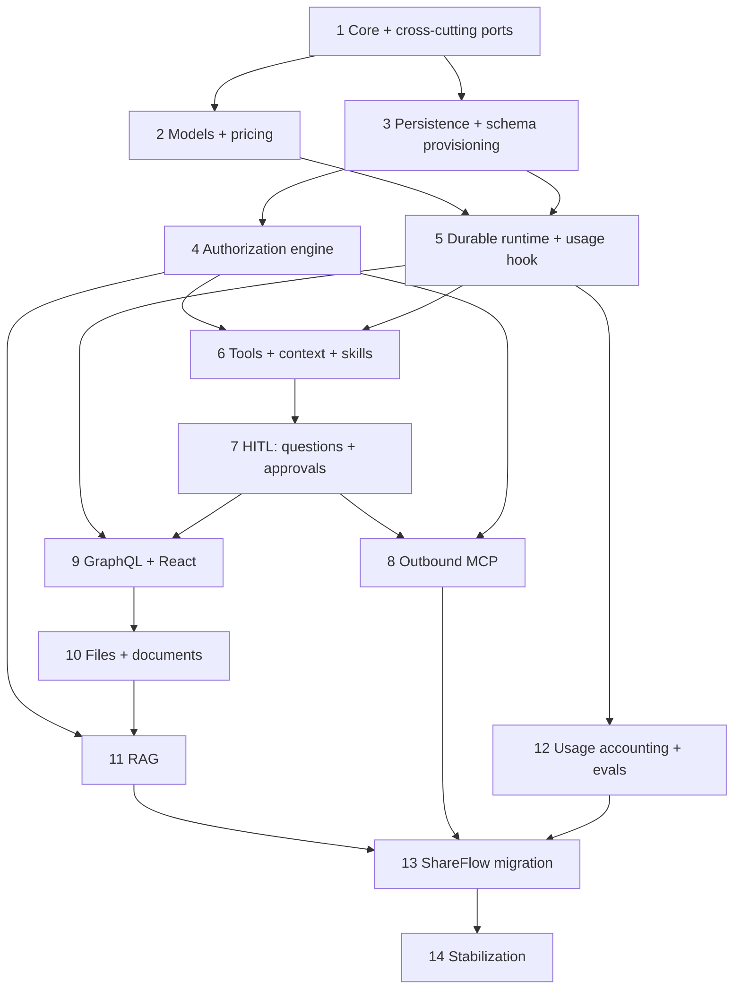

# Migration and Delivery Plan

## Strategy

Use a strangler migration. Establish a platform-owned protocol, run Agno and the new runtime behind it, migrate workflows individually, then remove AgentOS.

## Sequencing principles

The order below is chosen so that nothing built early is reworked later. Two rules drive it:

1. **Contract before implementation.** Cross-cutting concerns — authorization, usage
   recording, idempotency and every store method signature — have their *ports and types*
   defined in Phase 1. Downstream code targets those stable signatures immediately, so the
   later phase that supplies the full engine plugs in without changing a single caller.
2. **A phase only starts once everything it consumes at runtime exists.** A tool that can
   require approval cannot be finished before approvals exist; permission-aware retrieval
   cannot be finished before the authorization engine exists.

## Phases

| Phase | Estimate | Depends on | Exit deliverable |
|---|---:|---|---|
| 0. Baseline | 2 wk | — | Reconciled repository, frozen expansion and 100+ evaluation cases |
| 1. Core + cross-cutting ports | 3–4 wk | 0 | Monorepo, content parts, events, memory adapter, and the **contracts** everything targets: store signatures (`{tenantId}` + scope), `AuthorizationPolicy`, `UsageRecorder`, `SessionStateStore`, the thread/agent-binding record, idempotency and unit-of-work types |
| 2. Models + pricing | 2–3 wk | 1 | Provider factory, registry, capability/policy resolution, pricing metadata and contract tests |
| 3. Persistence + schema provisioning | 3–4 wk | 1 | Memory, PostgreSQL and Supabase stores with isolation tests and automatic startup schema provisioning |
| 4. Authorization engine | 2–3 wk | 3 | Real policy behind the Phase-1 port: tool filtering, `scope()` resolution and RLS alignment |
| 5. Durable runtime + usage hook | 4–5 wk | 2, 3 | BullMQ execution, checkpoints, cancellation, recovery, per-conversation run serialization, and usage + session-state written atomically in the completion transaction |
| 6. Tools + context + skills | 4–5 wk | 4, 5 | Lazy permission-aware tool catalog, meta-tools, inspectable prompt assembly, long-thread compaction and versioned skills |
| 7. HITL: questions + approvals | 2–3 wk | 6 | Durable questions, approvals and idempotent continuation gating external writes |
| 8. Outbound MCP | 1–2 wk | 4, 7 | Tenant MCP connections, egress policy, safe classification and namespaced discovery — after approvals exist, because MCP tools default to `external-write` |
| 9. GraphQL + React | 4–5 wk | 5, 7 | API, subscriptions, headless client and base components |
| 10. Files + documents | 5–7 wk | 9 | Attachments, parsing, OCR/vision, artifacts and exports |
| 11. RAG | 4–5 wk | 4, 10 | Hybrid permission-aware retrieval and citations |
| 12. Usage accounting + evals | 3–4 wk | 5 | Rollups, quota enforcement, cost reporting and the usage UI component on the Phase-5 recording hook, plus graders and release gates |
| 13. ShareFlow migration | 5–8 wk | 8, 11, 12 | Core social workflows on new runtime |
| 14. Stabilization | 3–4 wk | 13 | Second example consumer and prerelease/stable packages |

Estimated total: 47–64 engineer-weeks. Phases sharing no dependency edge (for example 2 and
3, or 4 and 5) can run in parallel to reduce calendar time.

## Why this order avoids rework

- **Authorization port in Phase 1, engine in Phase 4.** Persistence (Phase 3) writes every
  read as `scope`-filtered against the port, so when the engine lands the stores are already
  shaped correctly — no signature churn.
- **Usage recorder in Phase 1, hook in Phase 5, accounting in Phase 12.** The runtime records
  events from the day it exists; Phase 12 only adds aggregation, quotas and UI on top. The
  runtime is never reopened to add usage.
- **MCP after HITL, not before.** MCP tools default to requiring approval; building MCP
  (Phase 8) before approvals (Phase 7) would force a rewrite of the MCP execution path.
- **RAG after the authorization engine.** Permission-aware retrieval filters *before* search
  using `scope()`; building it before Phase 4 would mean re-plumbing the retrieval pipeline.
- **Session-state store in Phase 1, writes in Phase 5.** The runtime commits session state in
  the same completion transaction as messages from the day it exists; adding it later would
  reopen the completion path. Compaction waits for the context budget in Phase 6.

## First milestone

Reached at the end of Phase 9. A standalone package can:

1. Resolve a model through a provider adapter.
2. Persist conversation state through a storage adapter that provisioned its own schema.
3. Execute a run through BullMQ, recording usage as it goes.
4. Stream typed parts through GraphQL.
5. Discover authorization-filtered tools lazily.
6. Pause for a question or approval and resume safely.
7. Carry session state across turns in a thread bound to a specific agent.

RAG, documents and social tools begin after this foundation is verified.

## Extraction process

For each adapted subsystem:

1. Record source path and source commit.
2. Copy existing relevant tests where useful.
3. Replace framework and Twenty dependencies with neutral ports.
4. Rename public concepts to generic domain language.
5. Add memory-adapter tests.
6. Add a ShareFlow integration test separately.

## Release train

- `0.1-alpha`: core, cross-cutting ports, models and memory execution (Phases 1–2).
- `0.2-alpha`: persistence with schema provisioning and the authorization engine (Phases 3–4).
- `0.3-alpha`: durable jobs with usage recording, tools, context and skills (Phases 5–6).
- `0.4-alpha`: HITL and outbound MCP (Phases 7–8).
- `0.5-alpha`: GraphQL, React, files, OCR, PDF and documents (Phases 9–10).
- `0.6-alpha`: RAG and knowledge (Phase 11).
- `0.7-beta`: usage accounting, quotas and evals (Phase 12).
- `0.8-beta`: ShareFlow integration and hardening (Phase 13).
- `1.0`: stable API validated by two applications (Phase 14).

## Immediate planning backlog

1. Scope finalized as `@agentkit` (neutral); reserve the npm organization.
2. Decide standalone repository versus workspace-linked development.
3. Reconcile ShareFlow's divergent local branch without losing local changes.
4. Inventory exact Twenty source modules and dependency edges.
5. Define version-one public APIs for core and models, and — because everything targets
   them — the Phase 1 cross-cutting ports: store signatures, `AuthorizationPolicy`,
   `UsageRecorder`, `SessionStateStore`, the thread/agent-binding record, idempotency and
   unit-of-work types. Freeze these before Phase 3 starts.
6. Build the representative evaluation dataset.
7. Write Phase 1 implementation tasks and sequencing.
8. Settle the authorization permission model behind its Phase-1 port contract.
9. Define the MCP egress policy and administrator tool-classification workflow.
10. Choose the schema-provisioning default per adapter and the usage accounting currency.

