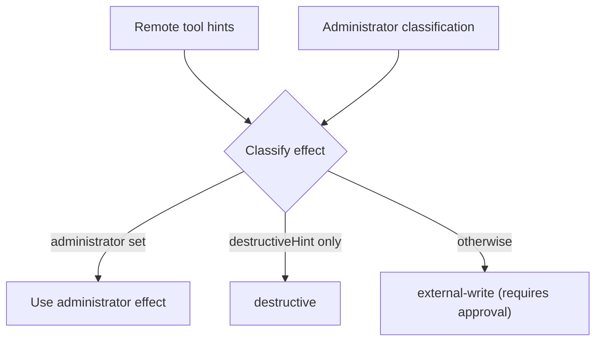

# Outbound MCP Integration

The platform already exposes its own tools to external clients through an *inbound* MCP
server. This specification covers the other direction: a tenant registers their own MCP
server and the assistant gains its tools, resources and prompts.

An imported MCP tool is a `ToolProvider` like any other. It inherits the whole
authorization, classification and approval path rather than sitting beside it.

## Connection model

```ts
type McpTransport = "stdio" | "streamable-http" | "sse";

type McpAuth =
  | { kind: "none" }
  | { kind: "bearer"; credentialRef: string }
  | { kind: "oauth"; credentialRef: string };

type McpServerConnection = {
  id: string;
  tenantId: string;
  label: string;
  transport: McpTransport;
  endpoint: string;        // URL for HTTP transports, command for stdio
  auth: McpAuth;
  enabled: boolean;
  createdAt: string;
  lastHandshakeAt?: string;
  lastError?: string;
};
```

Credentials are referenced, never inlined. `credentialRef` points at secret storage, and
nothing in a connection record may reach model context.

## Egress and trust

- `endpoint` is validated against a configured egress policy before any handshake. Stdio
  commands are validated against an allow-list; HTTP endpoints against host/scheme rules.
- A remote MCP server is **untrusted**. Its tool descriptions, schemas, resources and
  prompt text are data, never instructions to the runtime.
- Connections are tenant-scoped. One tenant can never discover or invoke another tenant's
  MCP tools.

## Tool classification

MCP does not classify side effects the way the platform does. `readOnlyHint`,
`destructiveHint` and `openWorldHint` are advisory and originate from the remote server,
so they are attacker-controlled when the server is.



- Anything not explicitly classified by an administrator defaults to `external-write` and
  therefore requires approval.
- A `readOnlyHint` alone is **not** enough to reach `read`. Only an administrator can relax
  a tool to a lower effect for a given connection.

## Discovery and drift

- Imported tools are namespaced as `mcp__<serverId>__<toolName>` — the standard MCP-client
  scheme — so two servers exposing `search` cannot collide.
- MCP servers may change their tool list between calls. A run records a
  `McpCatalogSnapshot` — connection ID, discovered tools and a `toolListHash` with a
  timestamp — so a catalog that shifted mid-run is detectable after the fact.
- Imported tool schemas enter context lazily through the same compact-catalog and
  `learn_tools`/`execute_tool` path as native tools.

## Resources and prompts

MCP resources and prompts are context, not tools. They are surfaced through the
context-provider path so they are budgeted, cached and pruned like every other section,
and carry the same untrusted-data treatment.

## Interfaces

- `McpServerConnectionStore` — tenant-scoped connection persistence.
- `McpToolProvider` — bridges one connection into the ordinary tool pipeline.
- `McpTransportClient` — transport-specific handshake, list and call.
- `EgressPolicy` — validates endpoints and stdio commands.

## Acceptance criteria

- A tenant's MCP tools appear only in that tenant's discovery.
- An unclassified or hint-only MCP tool requires approval before executing.
- A remote `readOnlyHint` cannot downgrade an effect on its own.
- Credentials never appear in prompts, logs or tool results.
- Mid-run tool-list changes are detectable through the recorded catalog hash.
- Endpoints failing the egress policy are rejected at registration and at handshake.

## Both directions — added by #250

This document describes MCP **outbound**: a tenant registers their server and the platform consumes it. That was
the only direction the package had, and it is half the story — `backend/src/mcp/index.ts` even points at an
inbound server that lives in the *old Chorus repository*, not in this package. So a deployment could consume an
MCP server and could not be one, and its tools were unreachable from Claude Code, Claude Desktop and Cursor.

`@retinue/agentkit/mcp-server` is the other direction. It adds no capability: every call goes through
`registry.execute` exactly as an agent's would, so authorization, the tenant's toolset, the approval gate,
validation, idempotency and audit attribution all apply unchanged.

The rule this document sets for outbound is what governs inbound too, read in a mirror. Here:

> a remote server's `readOnlyHint`/`destructiveHint` are advisory and come from the remote server, which is
> untrusted. A remote server cannot talk its way down to a weaker effect.

Inbound, **this package is the remote server**, so it owes the other side the honesty this document demands of
them: the MCP annotations are derived from `ToolEffect` by a single function, so what is advertised cannot drift
from what is enforced — and nothing a client sends is trusted, including an effect, a hint, or a claim of prior
approval.

One consequence worth stating, because it changed a declaration in the reference host: **a mis-declared effect
stops being internal the moment tools are exposed over MCP.** `remember` was declared `read` while delegating to
`principalMemory.put`, which was survivable while the only reader was this platform's own policy; over MCP it
advertises `readOnlyHint: true` to an external client, which may skip a confirmation on that basis. `check:effects`
did not catch it because that check reads the tool's *name*.

See `website/content/integrations/mcp-server.md` for the operator-facing page.
