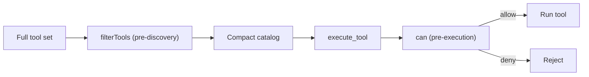

# Authorization

Authorization is referenced throughout the platform — `authorizationPolicyId` on agents,
`authorizationPolicy` in composition, `roleIds` on the execution context, permission-filtered
tool catalogs and permission-scoped knowledge chunks. This specification defines the model
those references share.

Authorization is a first-class port, never scattered `if` checks inside services.

## Principle

Every tenant-sensitive decision — discover a tool, execute a tool, read a file, retrieve a
chunk, open a conversation — is a permission check against the caller's
`ExecutionContext`. Model-generated input can never widen the caller's permissions.

## Policy port

```ts
interface AuthorizationPolicy {
  can(context: ExecutionContext, action: string, resource: ResourceRef): Promise<Decision>;
  filterTools(context: ExecutionContext, tools: ToolDescriptor[]): Promise<ToolDescriptor[]>;
  scope(context: ExecutionContext, resourceType: string): Promise<PermissionScope>;
}

type Decision = { allow: boolean; reason?: string; obligations?: Obligation[] };
```

- `can` answers a single point decision and may return obligations (for example, "requires
  approval" or "redact field X").
- `filterTools` produces the permission-filtered catalog before discovery.
- `scope` returns the query-time filter (tenant, roles, resource ACL) applied *before*
  search, so retrieval and listing never return unauthorized rows.

## Permission model

- Principals hold roles through memberships; roles grant permissions.
- Permissions are `action` + `resourceType` pairs, optionally narrowed by resource
  attributes (owner, collection, sensitivity, connection).
- Tenant policy may further restrict, but never expand, administrator defaults.
- Decisions are deterministic and cache-safe for the life of a request.

## Two-phase tool authorization



A tool that was discoverable earlier is re-authorized at execution. Direct execution of a
tool absent from discovery is rejected, not silently run.

## Relationship to other concerns

- **Approvals** (doc 04): an `external-write`/`destructive` effect combined with an
  obligation triggers `request_approval`. Authorization decides *who may*, approval decides
  *this specific action now*.
- **RLS** (doc 02): database row-level security enforces the same scope at the storage
  boundary as a defense in depth. `scope()` and RLS must agree.
- **RAG** (doc 05): `scope()` supplies the authorization filter applied before vector and
  keyword search.

## Two fail-closed approval layers, and telling them apart (#162)

A gated tool is guarded twice, independently:

1. `DelegatingToolDeps.approvals` — the delegating envelope's gate.
2. `ToolRegistryConfig.approval` — the registry's own check, which covers *every* tool including MCP-imported
   ones that never pass through an envelope.

Two layers is correct, and both defaults are correct: refusing when the dependency is absent is much better
than performing an unapproved side effect. What was missing was any way to tell the two situations apart. Both
refused with `approval_required`, and that was emitted both when a call was genuinely not approved — the correct,
expected refusal — and when **no approval check was configured at all**, so nothing could ever be approved.

Those are completely different facts. The second is a wiring bug that makes a whole class of tool permanently
unusable, and it presented as the first. It cost two rounds of debugging and a platform issue filed against the
wrong thing, because fixing one layer changed nothing observable while the other still refused identically.

Now:

- An absent check returns `capability_unavailable` with a message naming the tool **and the config field to
  set**, because a host with no diagnostics sink sees only the message.
- Both layers report once per tool through one `ToolMisconfiguration` sink — once, not per call, since a wiring
  bug read a hundred times is a wiring bug nobody notices. A construction-time scan is not possible:
  `ToolProvider.listTools` takes an `ExecutionContext`, so which gated tools exist is not knowable until a
  request is being served.
- The fail-closed behaviour is unchanged. Nothing here makes an unapproved side effect reachable.

The general rule this is an instance of: **a fail-safe default that is indistinguishable from correct operation
stops being a safety feature and becomes a debugging cost.**

## Auditing

Every deny, every granted external write and every obligation is recorded as an audit event
with context identity, action, resource and reason. Authorization changes are versioned.

## Acceptance criteria

- No store, tool or retrieval path executes without an explicit authorization decision.
- Unauthorized tools are absent from discovery and rejected on direct execution.
- Retrieval and list results never cross tenant or role scope, proven by isolation tests.
- Storage RLS and the policy port produce the same visibility for the same context.
- Denials and authorized external writes are auditable with a stable reason.
