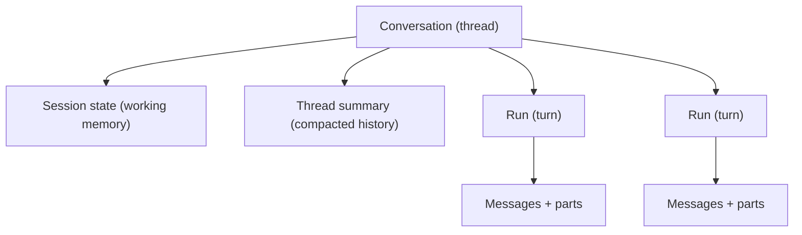

# Sessions, Threads and Session State

A **thread** is a Conversation. A **turn** is a Run. **Session state** is the durable
working memory a thread carries across its runs. The run lifecycle (doc 04) already
specifies a single turn; this specification defines the thread that owns those turns and
the state that survives between them.

## Model



Each run assembles its prompt from three durable sources: recent messages, session state
and the context providers (doc 03). Session state persists exactly what should **not** be
re-derived from message history every turn.

## Conversation record

The thread is more than a title. It records the binding and ownership needed for
deterministic continuity:

```ts
type Conversation = {
  id: string;
  tenantId: string;
  ownerPrincipalId: string;
  participantIds?: string[];
  agentId: string;
  agentVersionPolicy: "pinned" | "latest";  // pinned records agentVersion
  agentVersion?: number;
  sessionStateVersion: number;               // optimistic concurrency
  title: string;
  lastRunId?: string;
  archivedAt?: string;
  createdAt: string;
  updatedAt: string;
};
```

Binding the agent to the thread makes continuation deterministic: a resumed thread runs the
same agent (and, when pinned, the same version) that produced its earlier turns.

## Session state

Session state is a bounded JSON document, tenant- and conversation-scoped, under optimistic
concurrency.

- **Trusted, but validated.** It is written by the runtime and by tools through a typed,
  size-bounded handle — never by raw model output. The model *proposes* changes; a
  deterministic write commits them. No secrets may be stored in it.
- **Versioned.** Every write checks `sessionStateVersion`; concurrent writers cannot clobber
  each other.
- **Bounded.** A configured size ceiling is enforced; oversize writes fail clearly rather
  than silently truncating.

```ts
interface SessionStateStore {
  get(input: TenantScope & { conversationId: string }): Promise<SessionState | null>;
  put(input: TenantScope & { conversationId: string; expectedVersion: number; state: SessionState }): Promise<SessionState>;
}
```

## Run ordering and concurrency

A conversation may accept a new user message while a run is active (doc 04). Ordering is
made explicit here:

- Runs within one conversation are **serialized** under a per-conversation lock: at most one
  `Running` run at a time.
- Queued runs execute FIFO by enqueue time, so session-state and message order are
  deterministic.
- A run reads session state at claim time and commits its state write inside the same
  completion transaction that finalizes the turn, so state and messages never diverge.

## Long-thread compaction

When history outgrows the context budget (doc 03), older turns are compacted into a durable
**thread summary** rather than dropped:

- Recent turns and open tool continuity are preserved verbatim.
- Older turns are summarized into a versioned summary record that feeds the next prompt.
- Compaction emits the `context compacted` transport event (doc 04).

## Interfaces

- `ConversationStore` — thread CRUD, binding and ownership.
- `SessionStateStore` — versioned working memory.
- `ThreadSummaryStore` — versioned compacted history.
- `DistributedLockStore` — per-conversation run serialization.

## Acceptance criteria

- A resumed thread runs the same bound agent, and the same version when pinned.
- Session state survives across runs and is never written directly from model output.
- Concurrent session-state writes are rejected by version, never silently merged.
- Two queued runs in one conversation execute in enqueue order, never concurrently.
- Session state and final messages for a turn commit atomically.
- Compaction preserves recent turns and tool continuity and is observable as an event.
