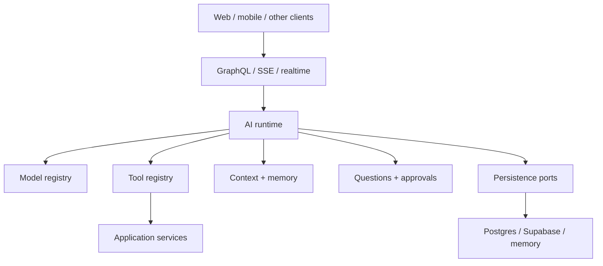

# Architecture

Retinue is a set of composable packages behind a single composition root, built on
ports-and-adapters so every piece of infrastructure is swappable.



## Principles

1. Every tenant-sensitive operation receives an explicit **tenant context** — model output can
   never override it.
2. Tools are **authorization-filtered before discovery** and re-checked at execution.
3. External writes require validation, **idempotency**, and the configured approval policy.
4. Conversations are owned by the platform, **never by a model provider**.
5. Infrastructure capabilities are **ports** with adapter implementations.
6. Large files and tool results are **referenced, not injected** wholesale into context.

## A run, end to end

```
Client → store message + queue Run
  → Worker claims Run (distributed lock; one at a time per thread)
  → Runtime assembles prompt: recent messages + memory + context providers (under budget)
  → streams provider/tool events into typed message parts
  → tools: permission-filtered; external writes pause for approval
  → checkpoints parts + publishes realtime diffs (refresh/reconnect safe)
  → completion txn: final state + usage + session state + audit, atomically
```

## Two profiles, one core

The **embedded** profile runs this in-process with an inline dispatcher; the **server** profile
runs it durably over BullMQ with GraphQL and realtime. Same runtime, different adapters.

See **[Agents](agents)** next.

## Where this is specified

This page is the shape of the thing. The specification is where the decisions and their reasons live — read it
when you need to know *why* something behaves the way it does, or what was considered and rejected.

- [Architecture](/specifications/architecture)
- [The platform's own goals](/specifications/platform)
