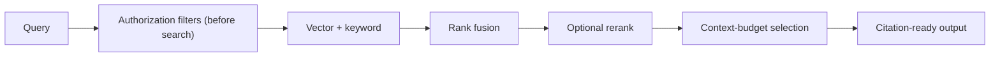

# Retrieval (RAG)

## What is it?

Permission-aware retrieval over your knowledge — documents, files, past sources — that returns
**cited** results resolving to exact source locations.

## Why would I use it?

To ground the agent in real, tenant-owned knowledge instead of the model's guesses — and to do
it without ever leaking one tenant's content to another.

## The pipeline

Authorization filters are applied **before** search — retrieval never returns another tenant's
content. Chunks retain source/version IDs and precise locations (page / slide / sheet / cell /
timestamp), so citations resolve exactly.

## Ingestion

Sources are authorized, extracted and normalized, **structure-aware chunked**, embedded and
keyword-indexed, then validated and published. Deleting a source removes its searchable content;
changing an embedding model supports versioned re-indexing.

## Configuration

| Option | Default | Description |
|---|---|---|
| `limit` | 5 | max chunks returned |
| `hybrid` | true | vector + keyword with rank fusion |
| `rerank` | off | optional cross-encoder rerank |
| `threshold` | 0.7 | similarity cut-off |

## Guarantees

- Retrieval never crosses tenant or role scope (proven by isolation tests).
- Citations resolve to exact source versions and locations.
- Removing a source removes its searchable content.

See the **[API Reference](/api/)** for the exact interfaces.
