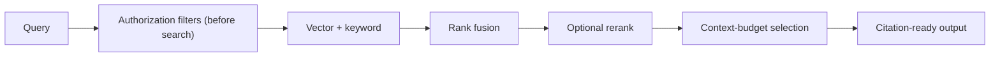

# Retrieval (RAG)

## What is it?

Permission-aware retrieval over your knowledge — documents, files, past sources — that returns
**cited** results resolving to exact source locations.

## Why would I use it?

To ground the agent in real, tenant-owned knowledge instead of the model's guesses — and to do
it without ever leaking one tenant's content to another.

## The pipeline

Authorization filters are applied **before** search — retrieval never returns another tenant's
content. Chunks retain source/version IDs and precise locations (page / slide / sheet / cell /
timestamp), so citations resolve exactly.

## Ingestion

Sources are authorized, extracted and normalized, **structure-aware chunked**, embedded and
keyword-indexed, then validated and published. Deleting a source removes its searchable content;
changing an embedding model supports versioned re-indexing.

## Configuration

| Option | Default | Description |
|---|---|---|
| `limit` | 5 | max chunks returned |
| `hybrid` | true | vector + keyword with rank fusion |
| `rerank` | off | optional cross-encoder rerank |
| `threshold` | 0.7 | similarity cut-off |

## Guarantees

- Retrieval never crosses tenant or role scope (proven by isolation tests).
- Citations resolve to exact source versions and locations.
- Removing a source removes its searchable content.

See the **[API Reference](/api/)** for the exact interfaces.

## Measured, on a real corpus

`evals/retrieval-quality.mjs` scores every mode over 56 documents of this repository's own technical prose. Two
results are worth knowing before you configure anything:

| Arm | success@5 | Recall | ms/query |
|---|---|---|---|
| keyword | 55.6% | 55.6% | 7 |
| **semantic** | **88.9%** | **83.3%** | 207 |
| hybrid (the default) | 72.2% | 72.2% | 220 |
| hybrid + exact-term reranker | 66.7% | 66.7% | 220 |

**Hybrid lost to semantic alone here**, because reciprocal rank fusion weights both signals equally and the
lexical signal is weak on natural-language questions over prose. It stays the default: that dataset has 18
queries and no *identifier* queries — an error code, a SKU — which is the case hybrid exists for. Know which kind
of query your corpus gets.

**The exact-term reranker's contribution is negative** (−5.6 points of success@5) and it is off by default. Leave
it off. The port is how a cross-encoder would be measured instead.

Chunking at 400/800 tokens is right for prose: halving it costs 11 points, doubling it changes nothing. The risk
is asymmetric — too small is expensive, too large is nearly free.

The full write-up, including a vector-less mode that ranks its first hit best and costs $0.0085 a query, is in
[Retrieval quality, measured](/specifications/retrieval-quality).

## Where this is specified

This page is the shape of the thing. The specification is where the decisions and their reasons live — read it
when you need to know *why* something behaves the way it does, or what was considered and rejected.

- [Knowledge and documents](/specifications/knowledge-and-documents)
- [Retrieval quality, measured](/specifications/retrieval-quality)
