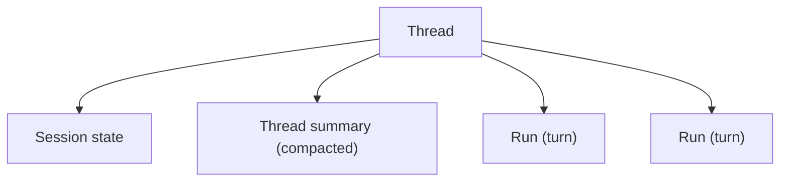

# Sessions & Threads

## What is it?

A **thread** is a conversation. A **turn** is a run. **Session state** is the durable working
memory a thread carries across its turns.

## Why would I use it?

So a conversation *is* a conversation — the agent continues where it left off without you
re-sending context, and long threads stay within budget instead of hitting a hard history cliff.

## How a turn assembles context

Each run builds its prompt from three durable sources — **recent messages + session state +
context providers** — under the model's token budget. Session state persists exactly what should
*not* be re-derived every turn.

## Ordering & consistency

- Runs in one thread are **serialized** (at most one running at a time), FIFO by enqueue.
- Session state is read at claim time and **committed in the same transaction** as the turn's
  messages — they can never diverge.
- The thread is **bound to an agent (+version)** for deterministic continuity.

## Long-thread compaction

When history outgrows the budget, older turns are **summarized into a versioned thread summary**
(recent turns and open tool calls kept verbatim) and a `context.compacted` event is emitted — the
frontend can show it.

## Configuration

| Behavior | Default |
|---|---|
| Concurrent runs per thread | 1 (serialized) |
| Session-state size | bounded; oversize writes fail clearly |
| Compaction | on when history exceeds the budget |

Next: **[Human-in-the-loop](human-in-the-loop)**.
